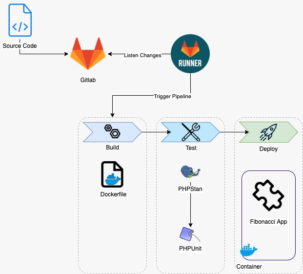

# Flix Fibonacci Series
   - PHP library which calculates nth Fibonacci number.
  
## Installation Locally
- If you don't have docker and docker-composer installed locally, then you should run the below command:
   * bash setup-docker.sh
- Now we should run docker-compose to run the project code analyzer and test-cases with the command below:
   * bash run-local.sh 

## Running Gitlab Pipeline
- To run gitlab pipeline first you should have to install gitlab runner locally. To install 
  gitlab locally you should run the command below:
   * bash setup-gitlab-runner.sh
- After installing gitlab runner, disable shared gitlab runner from gitlab repository i.e. setting->CI/CD->runners    
- Push project to gitlab repository and pipeline should start 
 
## Deployment Diagram
